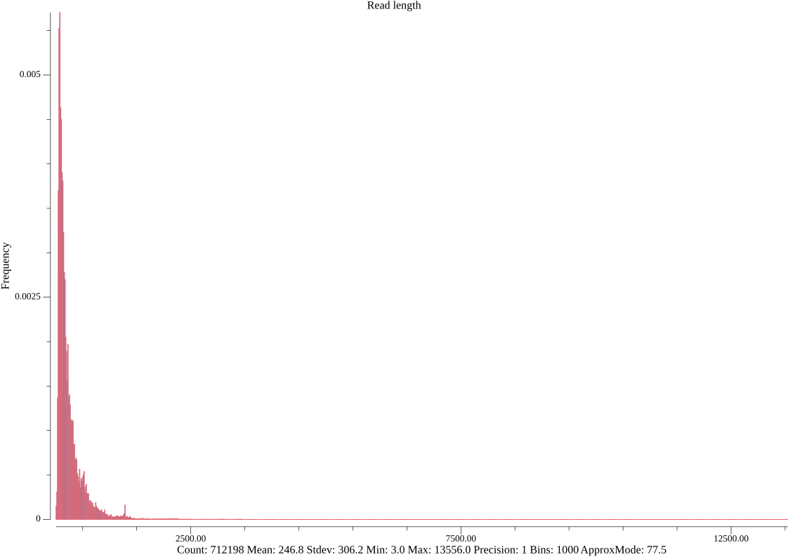

# Viral Proteins Sequence Based Clustering

## Description
This repository contains the following:
- Methodology for acquiring viral protein sequences, clustering them and select top 10k clusters (in terms of number of members in a cluster).
- Fastafiles both used and produced.
- Tabular files of cluster reps and members.
- A Python script to select cluster reps from clusters.
For this work the following tools were used:
	- MMseq2: to cluster the proteins and get preliminary cluster reps.
		https://github.com/soedinglab/MMseqs2
	- Seqkit: to get statists about the sequences and sort them. 
		https://bioinf.shenwei.me/seqkit/

## Methodology

### Download viral protein sequences.

- Using NCBI protein database, all fasta files of proteins with tax id 10239 (organism: Viruses) and with RefSeq entry were downloaded.

https://www.ncbi.nlm.nih.gov/protein/?term=(txid10239%5BOrganism%5D)+AND+%22refseq%22%5BFilter%5D

NOTE:Downloaded on 17th of April including 647,000 sequences.

- To include in our clustering already predicted and determined structures, viral sequences in PDB and in AlphaFold were downloaded. 
    For PDB, sequences were downloaded from NCBI as it has an entry for every chain.
	https://www.ncbi.nlm.nih.gov/protein

	Advance searh: txid10239[Organism] AND pdb[filter]

	NOTE:Downloaded on 19th of April including 65,159 sequences. 

	https://www.uniprot.org/uniprotkb?query=%28taxonomy_id%3A10239%29%20AND%20%28database%3Aalphafolddb%29

NOTE: File was downloaded on 20th of April 2023 including 39 sequences.

- File were concatenated to one fasta file with a total of 712,198 sequences and sorted with seqkit in terms of sequence length. The file name is AFDB_refsec_pdb_sorted_viral_p.fasta
- A final curation step was steps was done to have the pdb sequence ids to conform to the format xxxx_yy is done as follows:
    $cat AFDB_refsec_pdb_sorted_viral_p.fasta |sed 's/pdb|//'|tr '|' '_' >>all_vira_sequences_formatted.fasta

### Sequence Statstics

Seqkit is used to get statistics of the sequences with the following commands:

    #Get a log-scale histogram.
	$seqkit watch -f ReadLen  -L -B 1000 AFDB_refsec_pdb_sorted_viral_p.fasta -O seq_len_his_log.png

    # Get a normal scale histomgram.
	$seqkit watch -f ReadLen  -B 1000 AFDB_refsec_pdb_sorted_viral_p.fasta -O seq_len_his.png

")

### Clustering

With MMSeq2, the below command was run to get the clusters:

	$mmseqs easy-cluster all_vira_sequences_formatted.fasta vp_clusters tmp --min-seq-id 0.3 -c 0.01 --cov-mode 3 --threads 36

The choice of coverage mode is to minimize the number of clusters and yet having good separation with 30% identity. A total of 118,443 were produced.
Note: As the command is run on a 48-cores machine, using 36 threads was possible. On the same machine it was around 14 times faster to run with 36 cores compared to 1 core.

The above command produced 3 files:

- vp_clusters_all_seqs.fasta: fasta files containging cluster rep sequence ID and then the ids and sequences of each member.
- vp_clusters_rep_seq.fasta: Sequences of only the representatives.
- vp_clusters_cluster.tsv : Two columns with one row for each sequence. The first column is the cluster rep id and the send is the sequence id.

Using the last file, a file with the number of members in each cluster was generated with the below bash command:

	$cat vp_clusters_cluster.tsv | awk '{print $1}'|sort|uniq -c |awk '{print $2"\t"$1}'>cluster_sizes.csv

### Selecting Top Clusters Representative with select_clus_reps.py

A python script (select_clus_reps.py) was used to do the following:
- From the cluster_stat.csv file, make a histograme and get cluster sizes stats.
- Select largest 10k clusters (by identifying their reps).
- Select reps with prioritizing a determined or predicted sequence to be a Representative when available in a cluster. 
- Write the cluster reps in the file: top_viral_protein_cluster_reps.tsv. This resulted in 8956 refseq viral proteins to be folded. The remaining proteins are already determined (1014 PDB structures) or predicted in Alpha Fold DB (39 structures).
- Finally, get the fasta sequences of the proteins to be folded by using the clustering results fasta file (linearized) with the below command:

    $cat top_viral_protein_cluster_reps.tsv | awk '{print $4}'| grep '\.' |while read accn ;  do cat vp_clusters_rep_seq.fasta | grep -A1 -m 1 $accn >> top_cluster_reps_to_fold.fasta ;done
    

